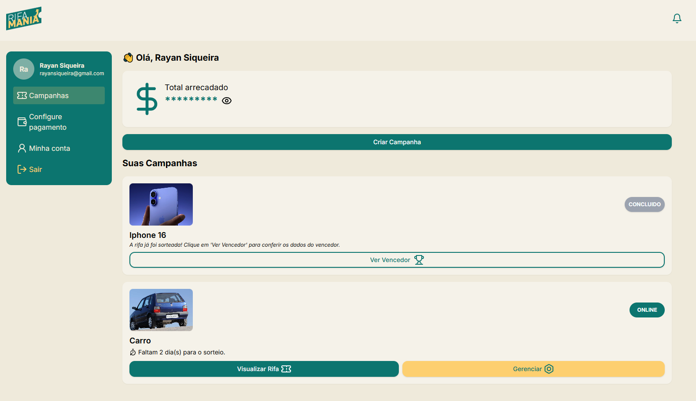

# Rifa Mania

Este é um projeto completo que envolve o desenvolvimento de um sistema de rifas online, com um backend em Node.js e um frontend em React. O objetivo do projeto é permitir aos usuários participarem de rifas online, com sorteios e atualizações automáticas de status, venda de tickets e links de venda compartilháveis.

## Funcionalidades

- Sistema de cadastro e gerenciamento de rifas.
- Acompanhamento de números disponíveis e sorteio de ganhadores.
- Notificações automáticas de status de rifas.
- Cron job para atualização de status de rifas em tempo real.
- Pagamento de rifas via pix utilizando api do Mercado Pago.
- Links de venda de rifas compartilháveis.

## Tecnologias Utilizadas

- **Frontend:** React, Tailwind CSS, Zod, React hook forms, framer motion
- **Backend:** Node.js, Prisma, Banco de Dados (PostgreSQL), Axios, Zod
- **Outros:** Cron jobs, Mercado Pago, APIs REST

## Screenshots

### Exemplo de tela de cadastro:

  

### Exemplo de tela de home:

  

## Como Rodar o Projeto

### Pré-requisitos
- Node.js
- PostgreSQL
- NPM

Abra cada pasta Web para detalhes do front-end e abra a pasta backEnd para saber cada passo de como rodar o projeto por completo.

## Contribuindo

Se você deseja contribuir com este projeto, faça um fork, crie uma branch, e envie um pull request. Fique à vontade para sugerir melhorias ou reportar problemas!

## Licença

Este projeto está licenciado sob a MIT License - veja o arquivo [LICENSE](LICENSE) para mais detalhes.
